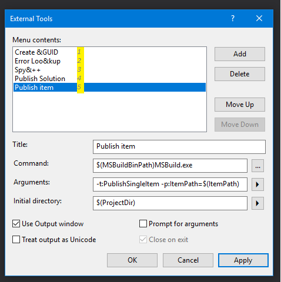

# Sitecore Helix Solution MS Build Example  

This solution shows how you can use msbuild and the "new" dotnet project format in a Sitecore Helix solution.  

No Gulp, Grunt, Cake, nant or other task runner beside msbuild. No custom build tasks or required nuget references.  

## The example features

- Automatic publish on builds from Visual Studio
- XML tranformation for config files and other xml on publish
- No dependencies on other than Visual Studio standard build targets
- PackageReferences for dependencies
  - Example on including content files from PackageReferences, see Foundation.Serialization module
- Helix solution and Module templates for the [Sitecore Visual Studio Helix Templates extension]([https://github.com/LaubPlusCo/helix-msbuild-example](https://marketplace.visualstudio.com/items?itemName=AndersLaublaubplusco.SitecoreHelixVisualStudioTemplates))

> ___
> NOTICE: This example only works in Visual Studio 2017 v15.6 or later)
> ___

## Introduction

The example utilize a Directory.Build.props and a Directory.Build.target file on solution level to load common properties and targets.

By separating the msbuild setup from the .csproj files these only contain project related setup and deviations from the solution-wide setup.

### Automatic publishing from Visual Studio

Publishing is controlled through properties set in [Publish.Properties.props](https://github.com/LaubPlusCo/helix-msbuild-example/blob/master/build/props/Build.Properties.props)

```xml
    <!-- PublishRootDirectory 
            Your Sitecore website root directory, used for publishing and xml transformations 
              Note: Override this property in .csproj or local Directory.Build.props file for specific publish targets -->
    <PublishRootDirectory>C:\Websites\Sitecore.Solution\Website</PublishRootDirectory>

    <!-- AutoPublishOnBuild
          Toogles automatic-publishing on builds, including from VS 
          see ./build/targets/Website.AutoPublish.targets for details -->
    <AutoPublishOnBuild>true</AutoPublishOnBuild>

    <!-- RunXmlTransformsOnPublish
          Toggles transforming xml files post publishing, 
          see ./build/targets/Website.TransformXml.targets for details -->
    <RunXmlTransformsOnPublish>true</RunXmlTransformsOnPublish>
```

To override these publishing settings locally you can create a `Website.Publishing.props.user` file in /build/props

_Ex. local Website.Publishing.props.user_
```xml
<Project>
  <PropertyGroup>
    <PublishRootDirectory>C:\Websites\Sitecore.Solution.Testing\Website</PublishRootDirectory>
  </PropertyGroup>
</Project>
```

### Controlling what is published

The Content item group that control the project file content is configured in [./build/props/Website.ProjectContent.props](https://github.com/LaubPlusCo/helix-msbuild-example/blob/master/build/props/Website.ProjectContent.props)

Globs are used in this file to include common ressource files and exclude other.

For your solution you may need to add font ressource files, other image types or similar. These files can also be individually included as Content in a project by modifying the "Build Action" property on the file in Visual Studio or manually edit the .csproj file.

## Getting back the Publish item command in Solution Explorer

The new project format does not utilize projecttype guids anymore.

This also means that the Visual Studio commands specific for Web Applications are not shown in Solution Explorer.

I really missed being able to right-click on individual files such as js and cshtml files and publishing these without running a project build.

To get a "Publish" button on individual items in Solution Explorer do the following:

1. Add an External tool that runs msbuild
   1. Open Tools > External Tools >> Add  
    
      - Title: Publish Single Item
      - Command: $(MSBuildBinPath)MSBuild.exe
      - Arguments: -t:PublishSingleItem -p:ItemPath=$(ItemPath)
      - Initial directory: $(ProjectDir)
      - Check: Use output window
      Make a note of the count position of the added external tool in the list (see screenshot - and no, we are not in 1995 anymore)
    1. Save and close
2. Add Command to Solution Explorer
   1. Open Tools > Customize >> Commands
   2. Find and Select in __Context Menu context__ - `Project and Solution Context | Item`  
    
   3. Add Command >> Tools >> External tool _x_  
       
   4. Modify Selection >> Change name to "Publish", close and save. _If warned of exe location just press `Yes`_  
      

__Protip__: You can make Publish Project/Solution commands using the same approach. Just change the arguments for msbuild accordingly on External tool and create command on  `Project and Solution Context | Project` or `Project and Solution Context | Solution`  

_I hope this approach just will be a temporary "hack" until VS provide better command customization support._

### More details

Please look at these files for details on the solution setup:

- https://github.com/LaubPlusCo/helix-msbuild-example/blob/master/src/Feature/DummyContent/website/Feature.DummyContent.csproj
- https://github.com/LaubPlusCo/helix-msbuild-example/blob/master/Directory.Build.props
- https://github.com/LaubPlusCo/helix-msbuild-example/blob/master/Directory.Build.targets
- https://github.com/LaubPlusCo/helix-msbuild-example/blob/master/build/props/Website.ProjectContent.props
- https://github.com/LaubPlusCo/helix-msbuild-example/blob/master/build/props/Website.PackageReferences.props
- https://github.com/LaubPlusCo/helix-msbuild-example/blob/master/build/props/Website.BuildProperties.props
- https://github.com/LaubPlusCo/helix-msbuild-example/blob/master/build/props/Website.Publishing.props
- https://github.com/LaubPlusCo/helix-msbuild-example/blob/master/build/targets/Website.AutoPublish.targets
- https://github.com/LaubPlusCo/helix-msbuild-example/blob/master/build/targets/Website.PublishSingleItem.targets
- https://github.com/LaubPlusCo/helix-msbuild-example/blob/master/build/targets/Website.TransformXml.targets
- https://github.com/LaubPlusCo/helix-msbuild-example/blob/master/build/targets/Website.DoNotPublishAssembly.props
- https://github.com/LaubPlusCo/helix-msbuild-example/blob/master/build/targets/Website.RemoveDoNotPublishAssembly.targets

### Website folder name convention

You may notice that the project root folder in this example is named `website` rather than `code`.

See [this pr from Rob Erlam](https://github.com/Sitecore/Helix.Docs/pull/15/files/a194b50dc59e01c8967f29079f9a8381043bdc98#diff-7e720abd1441590c56b5f15a190e9388) to the Helix docs. Naming the project root folder according to responsibility area in the solution - or really the publish target - makes much more sense than using the generic term `code`. I hope this pull request is accepted soon.

For existing solutions that follow the old convention of naming the folder `code` should of course stick to this until it make sense to change this. There are no buildtime dependencies on the naming of folders in this example as was the case with the Gulp tasks shown in the Habitat example.

The HelixTemplates included in this example use a replacement token for the folder name. Adjust the template manifest and template files to match your solution needs.

## Useful Links and Resources

- [How to upgrade your solution .csproj files](https://natemcmaster.com/blog/2017/03/09/vs2015-to-vs2017-upgrade/) to the "new" format.
- [VS2017 Extension for working with project files](https://marketplace.visualstudio.com/items?itemName=ms-madsk.ProjectFileTools)
- [Sitecore Visual Studio Helix Templates extension Git repo](https://github.com/LaubPlusCo/helix-msbuild-example)

# PLEASE CONTRIBUTE OR COMMENT

Please contribute to this example, comment on the approach, share your feelings..